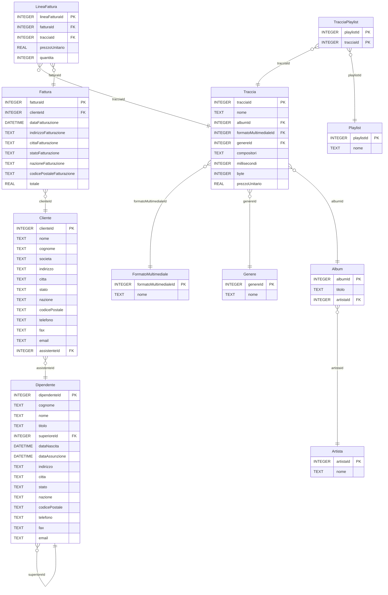

<!--
author:   Gionata Massi

email:    gionata.massi@savoiabenincasa.it

version:  2024-01-15

language: it

narrator: IT Italian Male

comment:  Query SQL su Chinook

import: https://raw.githubusercontent.com/liascript-templates/plantUML/master/README.md

import: https://raw.githubusercontent.com/liaScript/mermaid_template/master/README.md

-->

# Chinook - Esercizi SQL

Alcuni semplici esecizi di scrittura
di interrogazioni  sul database Chinook

Per visualizzare la presentazione apri il link:
https://liascript.github.io/course/?https://raw.githubusercontent.com/gionatamassibenincasa/as-23-24/main/5a-sia/Chinook-README.md


## Query semplici

<svg class="railroad-diagram" width="452" height="92" viewBox="0 0 452 92" xmlns="http://www.w3.org/2000/svg" xmlns:xlink="http://www.w3.org/1999/xlink">
<g transform="translate(.5 .5)">
<g>
<path d="M20 21v20m10 -20v20m-10 -10h20"></path>
</g>
<path d="M40 31h10"></path>
<g class="terminal ">
<path d="M50 31h0"></path>
<path d="M118 31h0"></path>
<rect x="50" y="20" width="68" height="22" rx="10" ry="10"></rect>
<text x="84" y="35">SELECT</text>
</g>
<path d="M118 31h10"></path>
<path d="M128 31h10"></path>
<g>
<path d="M138 31h0"></path>
<path d="M234 31h0"></path>
<path d="M138 31h10"></path>
<g class="non-terminal ">
<path d="M148 31h0"></path>
<path d="M224 31h0"></path>
<rect x="148" y="20" width="76" height="22"></rect>
<text x="186" y="35">Colonna</text>
</g>
<path d="M224 31h10"></path>
<path d="M148 31a10 10 0 0 0 -10 10v10a10 10 0 0 0 10 10"></path>
<g class="terminal ">
<path d="M148 61h24"></path>
<path d="M200 61h24"></path>
<rect x="172" y="50" width="28" height="22" rx="10" ry="10"></rect>
<text x="186" y="65">,</text>
</g>
<path d="M224 61a10 10 0 0 0 10 -10v-10a10 10 0 0 0 -10 -10"></path>
</g>
<path d="M234 31h10"></path>
<path d="M244 31h10"></path>
<g class="terminal ">
<path d="M254 31h0"></path>
<path d="M306 31h0"></path>
<rect x="254" y="20" width="52" height="22" rx="10" ry="10"></rect>
<text x="280" y="35">FROM</text>
</g>
<path d="M306 31h10"></path>
<path d="M316 31h10"></path>
<g class="non-terminal ">
<path d="M326 31h0"></path>
<path d="M402 31h0"></path>
<rect x="326" y="20" width="76" height="22"></rect>
<text x="364" y="35">Tabella</text>
</g>
<path d="M402 31h10"></path>
<path d="M 412 31 h 20 m -10 -10 v 20 m 10 -20 v 20"></path>
</g>
<style>
	svg {
		background-color: hsl(30,20%,95%);
	}
	path {
		stroke-width: 3;
		stroke: black;
		fill: rgba(0,0,0,0);
	}
	text {
		font: bold 14px monospace;
		text-anchor: middle;
		white-space: pre;
	}
	text.diagram-text {
		font-size: 12px;
	}
	text.diagram-arrow {
		font-size: 16px;
	}
	text.label {
		text-anchor: start;
	}
	text.comment {
		font: italic 12px monospace;
	}
	g.non-terminal text {
		/&#42;font-style: italic;&#42;/
	}
	rect {
		stroke-width: 3;
		stroke: black;
		fill: hsl(120,100%,90%);
	}
	rect.group-box {
		stroke: gray;
		stroke-dasharray: 10 5;
		fill: none;
	}
	path.diagram-text {
		stroke-width: 3;
		stroke: black;
		fill: white;
		cursor: help;
	}
	g.diagram-text:hover path.diagram-text {
		fill: #eee;
	}</style>
</svg>


* Elenca le tracce

  ```sql
  SELECT *
  FROM Traccia
  ```

## Operatori di aggregazione

* Quante tracce ci sono?

  ```sql
  SELECT count(tracciaId) AS numeroTracce
  FROM Traccia;
  ```

* Quanti Mega Byte occupa la traccia più grande?

  ```sql
  SELECT max(byte) / 1024 / 1024 AS MB
  FROM Traccia;
  ```

* Quanti secondi dura la traccia più breve?

  ```sql
  SELECT min(millisecondi) / 1000 AS durataInSecondi
  FROM Traccia;
  ```

* A quanto ammonta il ricavo totale?

  ```sql
  SELECT sum(totale) AS RicavoTotale
  FROM Fattura
  ```

* Qual è la media degli importo delle fatture?

  ```sql
  SELECT avg(totale) AS ImportoMedio
  FROM Fattura;
  ```

* Qual è il dipendente più giovane?

  ```sql
  -- Chi è il dipendente più giovane?
  SELECT MAX(dataNascita), cognome, nome
  FROM Dipendente
  ```

* Qual è l'età media, in anni, dei dipendenti? Assumo che siano nati il primo gennaio

  ```sql
  -- Qual è l'età media, in anni, dei dipendenti?
  SELECT avg(2024 - substr(dataNascita, 1, 4))
  FROM Dipendente
  ```


## Raggruppamenti

* A quanto ammonta il ricavo annuale?

  ```sql
  SELECT 
    sum(totale) AS RicavoAnnuo,
    substr(dataFatturazione, 1, 4) AS AnnoSolare
  FROM Fattura
  GROUP BY AnnoSolare
  ```

* Qual è la media degli importo delle fatture, per anno?

  ```sql
  SELECT 
    avg(totale) AS MediaAnnuaImportoFatture,
    substr(dataFatturazione, 1, 4) AS AnnoSolare
  FROM Fattura
  GROUP BY AnnoSolare
  ```

* Quante tracce vengono vendute allo stesso prezzo?

  ```sql
  -- Quante tracce vengono vendute allo stesso prezzo?
  SELECT
    prezzoUnitario,
    count(prezzoUnitario) AS numeroTracce
  FROM Traccia
  GROUP BY prezzoUnitario
  ```

## Restrizione

* Quali artisti hanno un nome che inizia per 'S'?

  ```sql
  -- Quali artisti hanno un nome che inizia per 'S'?
  SELECT *
  FROM artista 
  WHERE nome LIKE 'S%'
  ```

* Chi sono i clienti italiani?

  ```sql
  -- Chi sono i clienti italiani?
  SELECT nome, cognome
  FROM Cliente
  WHERE nazione = 'Italy';
  ```

* Quali sono gli album incisi dall'artista con id 50?

  ```sql
  -- Quali sono gli album incisi dall'artista con id 50?
  SELECT * 
  FROM Album
  WHERE ArtistaId = 50
  ```


```sql
-- Visualizzare solo i formati utilizzati per almeno
-- 200 delle tracce a catalogo
SELECT count(FM.nome) AS numeroTracce, FM.nome AS formato
FROM Traccia AS T
 INNER JOIN FormatoMultimediale AS FM
    USING (formatoMultimedialeId)
GROUP BY FM.formatoMultimedialeId
HAVING numeroTracce >= 200
```

## JOIN

```sql
SELECT count(*)
FROM
    Traccia
```

```sql
SELECT count(*)
FROM
    FormatoMultimediale
```

```sql
SELECT count(*)
FROM pragma_table_info('Traccia')
```

```sql
SELECT count(*)
FROM pragma_table_info('FormatoMultimediale')
```

```sql
SELECT *
FROM
    Traccia, FormatoMultimediale
WHERE Traccia.formatoMultimedialeId = FormatoMultimediale.formatoMultimedialeId
```

```sql
SELECT *
FROM
    Traccia INNER JOIN FormatoMultimediale
       ON Traccia.formatoMultimedialeId = FormatoMultimediale.formatoMultimedialeId
```

```sql
SELECT *
FROM
    Traccia AS T INNER JOIN FormatoMultimediale AS FM
       ON T.formatoMultimedialeId = F.formatoMultimedialeId
```
```sql
SELECT *
FROM
    Traccia AS T INNER JOIN FormatoMultimediale AS FM
       USING (formatoMultimedialeId)
```

```sql
SELECT P.nome AS playlist, T.nome AS traccia
FROM
    Playlist AS P INNER JOIN
    TracciaPlaylist AS TP
        ON P.playlistId = TP.playlistId
        INNER JOIN
    Traccia AS T
        ON TP.tracciaId = T.tracciaId
```

```sql
-- Determinare il nome della traccia, la quantità
-- e il prezzo unitario delle traccie registrate
-- nella fattura con fatturaId = 1
SELECT T.nome, LF.prezzoUnitario, LF.quantita
FROM Traccia AS T
    INNER JOIN LineaFattura AS LF
        ON T.tracciaId = LF.tracciaId
    INNER JOIN Fattura AS F
       ON LF.fatturaId = F.fatturaId 
WHERE F.fatturaId = 1
```

```sql
SELECT C.nome, C.cognome,
       F.fatturaId, F.dataFatturazione,
       T.nome AS traccia,
       LF.prezzoUnitario, LF.quantita
FROM Traccia AS T
    INNER JOIN LineaFattura AS LF
       ON T.tracciaId = LF.tracciaId
    INNER JOIN Fattura AS F
       ON LF.fatturaId = F.fatturaId
    INNER JOIN Cliente AS C
       ON F.clienteId = C.clienteId
WHERE
    C.nome = 'Daan' AND C.cognome = 'Peeters'
```

```sql
SELECT C.nome, C.cognome,
       F.fatturaId, F.dataFatturazione,
       count(LF.tracciaId) AS tracceAcquistate
FROM Traccia AS T
    INNER JOIN LineaFattura AS LF
       ON T.tracciaId = LF.tracciaId
    INNER JOIN Fattura AS F
       ON LF.fatturaId = F.fatturaId
    INNER JOIN Cliente AS C
       ON F.clienteId = C.clienteId
WHERE
    C.nome = 'Daan' AND C.cognome = 'Peeters'
GROUP BY F.fatturaId
```

```sql
-- Determinare, per ogni dipendente,
-- il numero di clienti assistiti
SELECT D.nome, D.cognome, count(clienteId)
FROM
    Dipendente AS D INNER JOIN
    Cliente ON dipendenteId = assistenteId
GROUP BY dipendenteId
```

```sql
-- Per ogni dipendente e per ogni genere, determinare
-- il numero di tracce acquistate dai clienti assistiti
SELECT D.nome, D.cognome,
       G.nome AS genereMusicale,
       count(T.tracciaId) AS numeroTracce
FROM Dipendente AS D
        INNER JOIN Cliente AS C
           ON D.dipendenteId = C.assistenteId
        INNER JOIN Fattura AS F
           ON C.clienteId = F.clienteId
        INNER JOIN LineaFattura AS LF
           ON F.fatturaId = LF.fatturaId
        INNER JOIN Traccia AS T
           ON LF.tracciaId = T.tracciaId
        INNER JOIN Genere AS G
           ON T.genereId = G.genereId
GROUP BY dipendenteId, G.genereId
```

```sql
-- Per ogni dipendente e per ogni formato, determinare
-- il numero di tracce acquistate dai clienti assistiti
SELECT D.nome, D.cognome,
       FM.nome AS formatoMultimediale,
       count(T.tracciaId) AS numeroTracce
FROM Dipendente AS D
        INNER JOIN Cliente AS C
           ON D.dipendenteId = C.assistenteId
        INNER JOIN Fattura AS F
           ON C.clienteId = F.clienteId
        INNER JOIN LineaFattura AS LF
           ON F.fatturaId = LF.fatturaId
        INNER JOIN Traccia AS T
           ON LF.tracciaId = T.tracciaId
        INNER JOIN FormatoMultimediale AS FM
           ON T.formatoMultimedialeId = FM.formatoMultimedialeId
GROUP BY dipendenteId, FM.formatoMultimedialeId
```

```sql
-- Determina il numero di tracce vendute
-- raggruppate per anno solare e
-- per nazione dell'acquirente
SELECT C.nazione,
    substring(F.dataFatturazione,1,4) AS anno,
    count(T.tracciaId) AS numeroTracce
FROM
    Cliente AS C
        INNER JOIN Fattura AS F USING (clienteId)
        INNER JOIN LineaFattura AS LF USING (fatturaId)
        INNER JOIN Traccia AS T USING (tracciaId)
GROUP BY nazione, anno
ORDER BY nazione, anno
```

```sql
-- Determina il numero di tracce vendute
-- raggruppate per anno solare,
-- per nazione dell'acquirente e genere
SELECT C.nazione,
    substring(F.dataFatturazione,1,4) AS anno,
    G.nome as genereMusicale,
    count(T.tracciaId) AS numeroTracce
FROM
    Cliente AS C
        INNER JOIN Fattura AS F USING (clienteId)
        INNER JOIN LineaFattura AS LF USING (fatturaId)
        INNER JOIN Traccia AS T USING (tracciaId)
        INNER JOIN Genere AS G USING (genereId)
GROUP BY nazione, anno, genereMusicale
ORDER BY nazione, anno, genereMusicale
```
