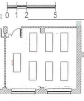

= Richiesta di offerta economica
Gionata Massi <gionata.massi@savoiabenincasa.it>
Rev 1, 2023-11-08
:spesa_complessiva: 30'000
:reproducible:
:experimental:
:idprefix:
:idseparator: -
:lang: it
:icons: font
:toclevels: 2
:toc: auto
:sectnumlevels: 5
:bibtex-file: ambienti-informatica.bib
:bibtex-style: ieee
:bibtex-order: alphabetical
:bibtex-locale: it-IT
:bibtex-throw: true
:xrefstyle: short
:stem: latexmath
//:source-highlighter: coderay
//:source-highlighter: pygments
ifdef::backend-pdf[]
:source-highlighter: rouge
:media: print
endif::backend-pdf[]
ifdef::backend-html5[]
:source-highlighter: highlight.js
:highlightjs-languages: shell, docker, cpp
endif::backend-html5[]
:pdf-page-size: A4
//:toc:
ifeval::["{lang}" == "it"]
:appendix-caption: Appendice
:caution-caption: Attenzione
:chapter-label: Capitolo
:chapter-signifier: Capitolo
:chapter-refsig: cap.
:example-caption: Esempio
:figure-caption: Figura
:important-caption: Importante
:last-update-label: Ultimo aggiornamento
:listing-caption: Elenco
:manname-title: NOME
:note-caption: Nota
:preface-title: Prefazione
:section-refsig: par.
:table-caption: Tabella
:tip-caption: Suggerimento
:toc-title: Indice
:untitled-label: Senza titolo
:version-label: Versione
:warning-caption: Attenzione
endif::[]
ifdef::backend-pdf[]
:mathematical-format: svg
:mathematical-inline: true
endif::[]
:runner-node: v18

== Introduzione

Si richiede un preventivo per la fornitura di un laboratorio finanziato dal PIANO NAZIONALE DI RIPRESA E RESILIENZA, MISSIONE 4: ISTRUZIONE E RICERCA, Azione 2 su Next generation lab e nello specifico come realizzazione di laboratori per le professioni digitali.

////
La professione digitale individuata è quella della consulenza nel settore delle tecnologie informatiche e il laboratorio è dedicato alla didattica di:

* **__Sviluppo del Software__**,
* **__Intelligenza Artificiale__**,
* **__Cyber Sicurezza__**,
* **__Internet delle Cose__**,
* **__creazione di prodotti e servizi digitali__**,
* __Sistemi Operativi__,
* __Reti di Calcolatori__,
* __Physical Computing__.

La spesa complessiva, inclusi trasporto ed eventuale montaggio, dovrebbe essere di circa {spesa_complessiva} €.
////

La fornitura dovrà corrispondere alla **Scheda 3 Acquisto, Leasing e Noleggio di computer e apparecchiature elettriche ed elettroniche**.

Il laboratorio informatico deve includere circa 30 postazioni studenti e una postazione docente, un terminal server, un NAS e i dispositivi necessari alla rete locale.

Si ipotizzano più soluzioni alternative che consentano il lavoro in gruppo, tipicamente in due (__pair programming__) e la possibilità di riconfigurare la rete dati per fini didattici (__analisi dei pacchetti__, attacchi __man in the middle__, __routing__) senza particolare attenzione alle prestazione dei calcolatori e delle reti.

=== Soluzione 0.B

Una ipotesi è quella di collocare il laboratorio in un'aula, codificata con 0.B, da arredare con sei scrivanie di dimensioni 180x90cm.

La disposizione delle scrivanie è come in <<fig:0b>> oppure la postazione del docente potrebbe essere collocata dal lato opposto.

[[fig:0b]]
.Collocazione delle scrivanie in aula 0.B

L'architettura di rete è in <<fig:arch-lab-6>>, dove il significato delle sigle è:

Terminal server:: il computer che fornisce i servizi per: 
+
* mostrare il menu di avvio iniziale del client e caricare il kernel/initrd (boot loader di rete)
* assegnare gli IP ai client (server DHCP o ProxyDHCP)
* inviare ipxe/kernel/initrd ai client (server TFTP)
* fornire una cache DNS con blacklist (server DNS)
* autenticare gli utenti (server LDAP)
RPi31:: il computer ad uso del docente,
RPi1..RPi30:: i computer destinati agli studenti,
Sw1..Sw6:: switch di rete,
NAS:: un dispositivo usato per centralizzare l'immagazzinamento dei dati che è accessibile a tutti i nodi della rete,
WiFi:: un eventuale hotspot appartenente alla rete del laboratorio.

[[fig:arch-lab-6]]
.Architettura di rete con 6 scrivanie
[graphviz, target="architettura-switches-rpis-6", format="svg"]
....
graph {
    gw [shape=circle];
    ts [shape=box label="Terminal\nserver"];
    Sw7 [shape=box];

    sw1 [shape=box label="Sw1"];
    sw2 [shape=box label="Sw2"];
    sw3 [shape=box label="Sw3"];
    sw4 [shape=box label="Sw4"];
    sw5 [shape=box label="Sw5"];
    sw6 [shape=box label="Sw6"];

    subgraph desktop_switches_r_1 {
        label="Switch per\nscrivania";
        { rank=same  sw1 sw3 }
    }
    subgraph desktop_switches_r_2 {
        label="Switch per\nscrivania";
        { rank=same  sw2 sw4 }
    }

    gw -- ts [label=eth0];
    ts -- sw7 [label=eth1];

    sw1 -- sw3;
    sw3 -- sw5;
    sw2 -- sw4;
    sw4 -- sw6;
    sw7 -- sw1;
    sw7 -- sw2;
    
    sw1 -- RPi1;
    sw1 -- RPi2;
    sw1 -- RPi3;
    sw1 -- RPi4;
    sw1 -- RPi5;

    NAS [shape=cylinder];
    RPi31 [shape=doublecircle]
    sw7 -- NAS;
    sw7 -- RPi31;

    sw6 -- RPi21;
    sw6 -- RPi22;
    sw6 -- RPi23;
    sw6 -- RPi24;

    sw7 -- WiFi;
}
....

Su ogni scrivania sono presenti quattro postazioni aventi una scheda https://datasheets.raspberrypi.com/rpi5/raspberry-pi-5-product-brief.pdf[Raspberry Pi 5] con 8 GB di RAM inserita nel https://datasheets.raspberrypi.com/case/case-for-raspberry-pi-5-product-brief.pdf[case con ventola] (98,5 x 70,3 mm, consumo massimo 12 W), una https://datasheets.raspberrypi.com/keyboard-mouse/keyboard-mouse-mechanical-drawing.pdf[tastiera] (248,4 x 121,61 mm) e un mouse (109,93 x 64,12 mm), un cavo HDMI connettori Micro-HDMI e HDMI lungo 1 m e un monitor (consumo massimo di circa 15 W).
Ogni scrivania dispone di uno switch di rete 8 porte (131 x 82 mm), una delle quali è collegata ad una presa di rete già presente o, a cascata, ad un altro switch alimentato da un alimentatore 5V/1A (consumo massimo 5,4 W).
Su ogni scrivania devono essere previste almeno 9 prese della rete elettrica 10 A, di cui quattro distanziate almeno 5 cm tra loro, in grado di operare alla potenza massima dissipata di meno di 130 W (0,5 A).

[[sec:requisiti-labs]]
== Specifica dei requisiti

[[sec:req-generali]]
=== Requisiti generali dell'ambiente laboratoriale di Informatica

L'insegnamento i questo ambienti di apprendimento digitale deve soddisfare le seguenti specifiche:

. Gli studenti devono disporre di un banco o una scrivania
.. Il banco o la scrivania devono essere sufficientemente ampi da consentire la presenza di un dispositivo PC/SBC, di una scheda programmabile e di un quaderno
. Ogni postazione deve essere dotata di uno più dispositivi di calcolo
. Ogni postazione deve essere dotata di un monitor
.. Il monitor deve avere una diagonale di almeno circa 20''
.. Il monitor deve essere compatibile con lo standard HDMI
. Ogni postazione deve essere dotata di una tastiera
. Un dispositivo per la progettazione di sistemi elettronici deve essere condiviso tra almeno 3 studenti
. Le cartelle degli utenti devono essere gestite da un server esterno o un NAS
. I servizi di autenticazione, monitoraggio e controllo sono gestiti da un server
. Il software applicativo e di base deve rilasciato con licenze libere ex art. 68 CAD e Linee guida su acquisizione e riuso di software per le pubbliche amministrazioni
////
. Ogni postazione dovrebbe essere orientata verso il docente
. Il docente deve poter gestire in autonomia i PC/SBC del laboratorio
.. Il docente deve poter monitorare a distanza i PC/SBC del laboratorio
... Il docente deve poter visualizzare la schermata dei PC/SBC del laboratorio dove sta insegnando
... Il docente deve poter salvare la schermata dei PC/SBC del laboratorio dove sta insegnando
.. Il docente deve poter controllare a distanza i PC/SBC del laboratorio
... Il docente deve poter bloccare i dispositivi di input
... Il docente deve poter prelevare da remoto i file
... Il docente deve poter trasmettere lo schermo del proprio PC/SBC a quello degli studenti
.. Il docente e studenti devono poter condividere gli schermi
. Il docente deve poter condividere applicazioni e servizi con gli studenti
.. Il docente deve poter gestire una macchina server, reale o virtuale, per creare e rimuovere utenti, applicazioni e servizi
.. La macchina server si collega al servizio LDAP oppure mantiene l'elenco degli utenti
.. Il docente deve poter installare pacchetti sulla macchina server
.. Il docente deve poter avviare e terminare servizi sulla macchina server
.. I PC devono poter avviare le applicazioni sulla macchina server
... I PC devono supportare il forwarding per le applicazioni grafiche
. Il docente deve poter controllare gli accessi ad internet
.. Il docente deve poter impedire l'accesso ai file condivisi, ad eccezione dell'eventuale deposito della prova
.. Il docente deve poter impedire la ricerca di informazioni nella rete Internet su siti non esplicitamente consentiti (whitelist)
.. Il docente deve poter impedire lo scambio di messaggi con sistemi di chat (es: Google Chat), webmail (es: GMail) o altro (es: Whatsapp web, Google Drive)
. Il docente deve poter controllare il DNS per rimuovere messaggi pubblicitari
////

=== Requisiti dei server

Il laboratorio è realizzato con postazioni aventi risorse di calcolo e archiviazione molto limitate.

Per sopperire a questi vincoli si devono:

* memorizzare le _home directory_ degli studenti in un NAS
* disporre di un server per l'esecuzione di task complessi

Si assume che gli utenti del laboratorio possano essere fino a 30 studenti contemporaneamente.

. I computer devono prelevare il sistema operativo da un server PXE e devono lavorare anche in assenza di dispositivi di memorizzazione.
. Il computer usato come server PXE deve gestire anche l'autenticazione degli utenti, il filtraggio della rete e del web, il monitoraggio delle postazioni e ulteriori servizi e applicazioni di rete.
. Il server deve fornire l'ambiente di esecuzione di programmi di calcolo scientifico tramite **The Littlest JupyterHub**.
. Il server deve fornire l'ambiente di esecuzione di Learning Management Systems tramite **Moodle**.
. Il server deve fornire l'ambiente di esecuzione di sistemi di gestione delle competizioni di informatica quali **CMS::Main Contest Management System** e **Terry**.
. Il server deve fornire l'ambiente di esecuzione di sistemi di gestione delle competizioni di cyber-sicurezza quali **CTFd**.

=== Requisiti del NAS

. I computer devono memorizzare i dati degli utenti (directory `home`) su un NAS.

////

[[sec:req-software]]
=== Requisiti sulla disponibilità di applicazioni

La didattica dell'informatica in laboratorio, in relazione alle programmazioni dipartimentali dell'informatica, ai libri di testo adottati, alle Linee Guida e delle Indicazioni Nazionali, e alla https://www.consorzio-cini.it/images/Proposta-Indicazioni-Nazionali-Informatica-Scuola-numerata.pdf[Proposta di Indicazioni Nazionali per l'insegnamento dell'Informatica nella Scuola] del CINI richiede l'installazione delle seguenti applicazioni:

. Monitoraggio e controllo
.. https://veyon.io/it/[Veyon]
. Applicazioni
.. Software per l'ufficio
... https://it.libreoffice.org/[LibreOffice]
.... https://it.libreoffice.org/scopri/base/[LibreOffice Base]
.... https://it.libreoffice.org/scopri/calc/[LibreOffice Calc]
.... https://it.libreoffice.org/scopri/charts/[LibreOffice Charts]
.... https://it.libreoffice.org/scopri/draw/[LibreOffice Draw]
.... https://it.m.wikipedia.org/wiki/File:LibreOffice_6.1_Impress_Icon.svg[LibreOffice Impress]
.... https://it.libreoffice.org/scopri/math/[LibreOffice Math]
.... https://it.libreoffice.org/scopri/writer/[LibreOffice Writer]
.... https://help.libreoffice.org/latest/it/text/swriter/librelogo/LibreLogo.html[LibreLogo]
... Software per la lettura dei PDF
.. Software per l'editoria
... https://www.tug.org/texlive/[TeX Live]
... https://www.lyx.org/[LyX]
... https://asciidoctor.org/[Asciidoctor]
.... https://docs.asciidoctor.org/diagram-extension/latest/[Asciidoctor Diagram]
.... https://docs.asciidoctor.org/pdf-converter/latest/[Asciidoctor PDF]
.... https://docs.asciidoctor.org/epub3-converter/latest/[Asciidoctor EPUB3]
.... https://docs.asciidoctor.org/reveal.js-converter/latest/[Asciidoctor reveal.js]
.... https://github.com/asciidoctor/asciidoctor-bibtex[asciidoctor-bibtex]
.... https://github.com/rouge-ruby/rouge[Ruby rouge]
.... https://github.com/rubychan/coderay[Ruby coderay]
.... https://github.com/pygments/pygments.rb[Ruby pygments.rb]
.. Stampa
... http://www.cups.org/[CUPS]
.. Interpreti, compilatori, debugger, toolchain
... https://gcc.gnu.org/[GCC, the GNU Compiler Collection]
... https://clang.llvm.org/[Clang]
... https://www.php.net/[php]
... https://nodejs.org/[Node.js] + https://pnpm.io/it/[pnpm] + https://www.typescriptlang.org/[TypeScript] + https://nativescript.org/[NativeScript]
... https://www.python.org/[Python 3]
... https://www.r-project.org/[R]
... https://www.ruby-lang.org/it/[Ruby]
... https://www.minizinc.org/[MiniZinc]
... https://www.sourceware.org/gdb/[gdb]
... https://lldb.llvm.org/[lldb]
... https://rr-project.org/[rr]
... https://valgrind.org/[Valgrind]
... https://ghidra-sre.org/[ghidra]
... https://cmake.org/[CMake]
... https://www.gnu.org/software/make/[GNU Make]
.. Ambienti integrati di sviluppo
... https://code.visualstudio.com/[VS Code]
//... QT Creator
... https://www.codeblocks.org/[Code::Blocks IDE]
... https://www.vim.org/[vim]
... https://jupyter.org/[Jupyter Lab]
...  https://posit.co/products/open-source/rstudio/[RStudio Desktop Open Source Edition]
... http://www.flowgorithm.org/[Flowgorithm], https://www.imparando.net/sito/strumenti_di_sviluppo/flowgorithm/come_installare_in_linux.htm[sotto Linux]
... https://education.lego.com/it-it/downloads/mindstorms-ev3/software#downloads[LEGO® MINDSTORMS® Education EV3 Classroom] (solo su alcuni notebook)
... https://www.kogics.net/sf:kojo[Kojo]
... https://racket-lang.org/[Racket]
.. Strumenti di versionamento
... https://git-scm.com/[git]
.. Accesso remoto
... https://www.openssh.com/[ssh]
... https://openvpn.net/[openVPN client]
.. Audio e video
... https://www.audacityteam.org/[Audacity]
... https://ffmpeg.org/[FFMPEG]
... https://shotcut.org/[Shotcut]
.. Browser
... https://www.mozilla.org/it-IT/firefox/[Firefox]
// ... https://www.google.com/intl/it_it/chrome/[Chrome]
.. CAD
... https://www.freecadweb.org/index.php?lang=it[FreeCad]
.. Grafica
... https://www.gimp.org/[GNU Image Manipulation Program]
... https://inkscape.org/[Inkscape]
... https://graphviz.org/[GraphViz]
... http://www.gnuplot.info/[GnuPlot]
... https://www.imagemagick.org/[imagemagick]
... https://plantuml.com/[PlantUML]
... https://kroki.io/[Kroki]
.. Calcolo scientifico e ingegneristico
... https://octave.sourceforge.io/[GNU Octave (octave-forge)]
... https://www.scilab.org/[Scilab]
... https://www.geogebra.org/?lang=it[GeoGebra]
... https://www.r-project.org/[R]
... https://conda.io/miniconda.html[miniconda]
.. MindMapping
... https://www.freeplane.org/[FreePlane]
... https://plantuml.com/[PlantUML]
.. Software per l'analisi della rete
... https://www.wireshark.org/[WireShark]
... https://en.wikipedia.org/wiki/Ping_(networking_utility)[ping]
... https://linux.die.net/man/8/ethtool[ethtool]
... http://www.illuminamente.org/dokuwiki/doku.php?id=educare:dnsutils[dig, dnsutils, bind-utils]
... ip
... https://it.wikipedia.org/wiki/Netcat[netcat]
... https://nmap.org/[nmap]
.. Software per la configurazione del firewall
... http://gufw.org/[gufw]
. Servizi
.. Web server
... https://httpd.apache.org/[Apache]
... https://www.nginx.com/[Nginx]
.. Data Base Management System
... https://www.postgresql.org/[PostgreSQL]
... https://www.mysql.com/[MySQL]
.. GUI per SQLite
... https://sqlitebrowser.org/[DB Browser for SQLite]
... https://sqlitestudio.pl/[SQLite Studio]
... https://dbeaver.io/[DBeaver]
.. Learning Management Systems
... https://moodle.org/?lang=it[Moodle]
... https://www.leemons.io/[Leemons]
.. Consegna dei compiti di programmazione
... https://github.com/cms-dev/cms[CMS]
... https://github.com/algorithm-ninja/cmsocial[CMSSocial]
.. Piattaforma per il Cloud
... https://nextcloud.com/[Nextcloud]
.. Tutela della Privacy
... https://cryptomator.org/[Cryptomator]
... https://gnupg.org/[GNU GPG]
... https://apps.kde.org/it/kleopatra[Kleopatra]

==== Applicazioni per l'allenamento alle competizioni di CyberSicurezza

Si elencano le applicazioni consigliate dal https://training.olicyber.it/training/environment[CyberSecurity National Laboratory], divise per le categorie di problemi nelle Olimpiadi della CyberSicurezza.

===== Miscellaneous

* Curl: `sudo apt install curl`
* PHP: `sudo apt install php`
* Python: `sudo apt install python3.10`
* PIP: `sudo apt install python3-pip`
* Git: `sudo apt install git`
* JDK 17: https://adoptium.net/installation/linux/[download]
* Visual Studio Code: https://code.visualstudio.com/docs/setup/setup-overview[download]
* Ngrok: https://ngrok.com/download[download]
* Docker Desktop: https://docs.docker.com/desktop/[download]

===== Steganography

* Binwalk: `sudo apt install binwalk`
* Gimp: https://www.gimp.org/downloads/[download]
* Stegsolve: https://wiki.bi0s.in/steganography/stegsolve/[download]
* JohnTheRipper: https://github.com/openwall/john/blob/bleeding-jumbo/doc/INSTALL-UBUNTU#L97[download] (seguire le istruzioni da riga 97 a riga 107).

===== Network Security

* Wireshark: `sudo apt install wireshark`
* Tshark: `sudo apt install tshark`
* Pyshark: `pip install pyshark`

===== Web Security

* Burp Suite Community: selezionare la versione "Burp Suite Community Edition" dal dropdown menu e il sistema operativo
              corretto al seguente https://portswigger.net/burp/releases/professional-community-2022-12-5[link], poi eseguire il file scaricato.
* Postman: https://www.postman.com/downloads/[download]

===== Software Security

* Ht editor: `sudo apt install ht`
* Ltrace: `sudo apt install ltrace`
* GDB debugger: `sudo apt install gdb`
* Pwndbg: https://github.com/pwndbg/pwndbg[download]
* Pwntools: `pip install pwntools`
* Ropper: `pip install ropper`
* Patchelf: `sudo apt install patchelf`
* Elfutils: `sudo apt install elfutils`
* Ruby-dev, one_gadget e seccomp-tools:
** `sudo apt install ruby-dev`
** `sudo gem install one_gadget`
** `sudo gem install seccomp-tools`
* Ghidra: https://github.com/NationalSecurityAgency/ghidra/releases[download], (necessita JDK, vedi "Misc")

===== Cryptography

* Pycryptodome: `pip install pycryptodome`
* Sagemath: `sudo apt install sagemath-jupyter`
* Mtp: `pip install mtp`
////

== Fornitura ipotizzata

Si individuano:

- una postazione docente con scrivania già in possesso della scuola
- 5 isole su scrivanie a 6 posti per studenti
- un single board computer o mini-pc, possibilmente con GPIO, per studente
- una scheda elettronica prototipale per studente
- un computer che agisca da server di rete
- un NAS per l'archiviazione

Per realizzare il laboratorio si ipotizzano le seguenti dotazioni:

dotazioni digitali::

- dotazione tecnologica - Computer:

** 31 Raspberry Pi 5 8GB o equivalenti (NVIDIA Jetson Orin Nano 8 GB, NVIDIA Jetson Nano 4GB, Orange Pi 5 8GB, Rock 5 Model B 8 GB, Tinker Board 3N, Banana Pi BPI-M6...),
** 31 monitor >= 20'' possibilmente con altoparlanti e webcam,
- almeno 10 micro:bit v2,
- almeno 10 Kitronik Inventor's Kit per BBC microbit,
//- almeno 30 "ribbon cable" per il collegamento dei GPIO,
- n switch 8 porte (uno per scrivania e uno per server, postazione docente, NAS, terminal server e hub),
- cavi patch cat. 6A per il cablaggio.

arredi::
- n scrivanie.

varie::
- multiprese da scrivania (almeno due per scrivania) aventi ognuna almeno 1 presa Schuko e tre prese italiane 10+16 A,
- materiale di supporto vario tra cui: cavi di rete ed elettrici per i collegamenti delle scrivanie, canaline calpestabili per uso domestico oppure canaline in sospensione.

Per un prospetto indicativo relativo alle componenti elettroniche sa veda la <<tab::dotazione>>.

[[tab::dotazione]]
[options="header,footer",format=tsv,cols="5,25,<63,>12,0,0,0,0"]
.Ipotesi beni per realizzare il laboratorio
|===
include::distinta_lab_stem.tsv[]
|===

Cordiali saluti, +
Gionata Massi